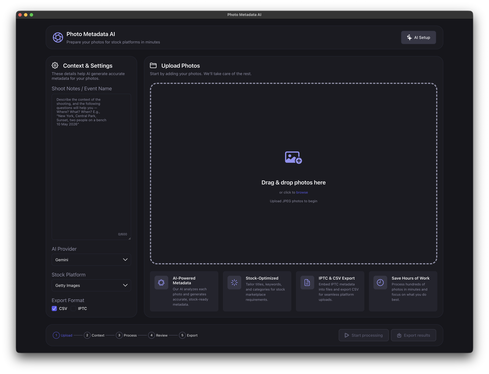
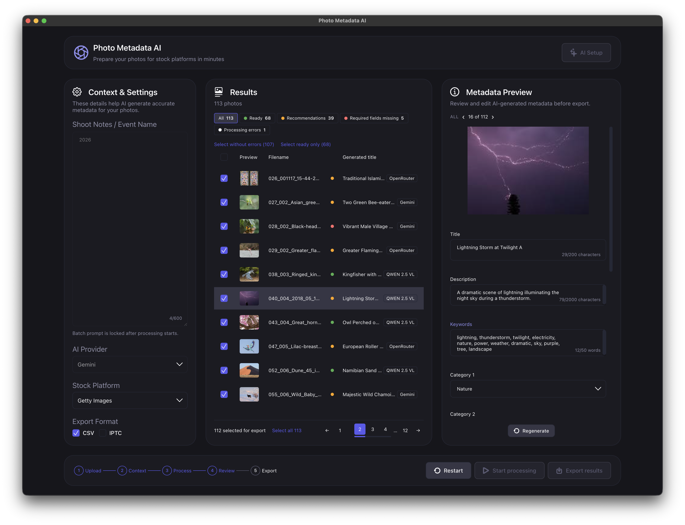
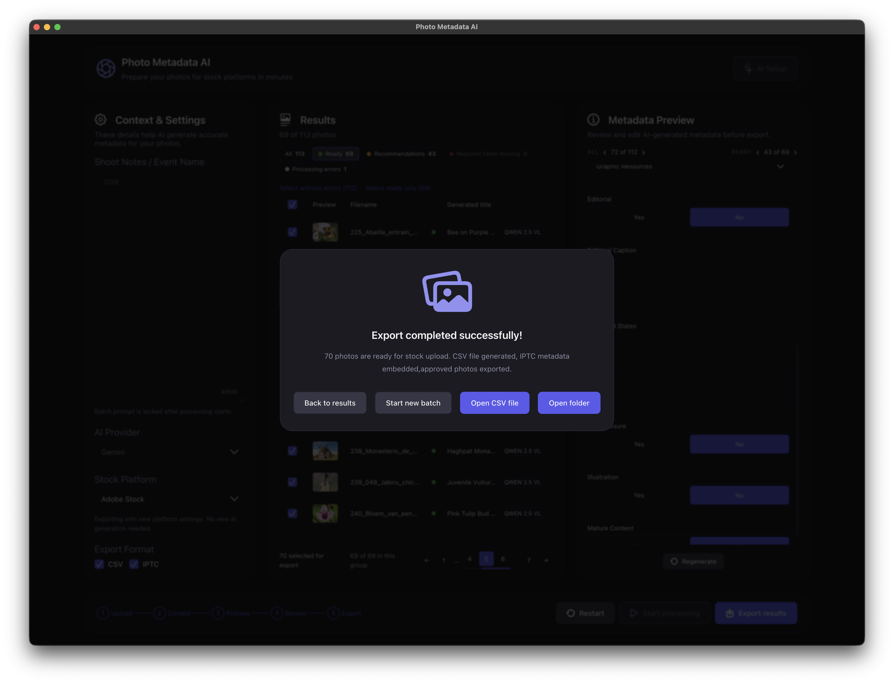

# Photo Metadata AI

Десктопное приложение для macOS, которое готовит фотографии к загрузке на фотостоки:
анализирует каждый кадр с помощью AI, генерирует название, описание, ключевые слова
и категорию по правилам конкретного стока, вшивает метаданные в файлы (IPTC/XMP/EXIF)
и выгружает CSV в формате Adobe Stock, Shutterstock или Getty Images.

Приложение работает локально: фотографии не покидают компьютер, кроме кадров,
отправляемых выбранному AI-провайдеру. При использовании локальной Ollama обработка
полностью офлайн.



## Возможности

- **Пакетная обработка.** Загрузка сотен фотографий за раз, прогресс с возможностью
  отмены, повтор только упавших файлов.
- **Три AI-провайдера.** Локальная Ollama (Qwen2.5-VL), Google Gemini, OpenRouter.
  Провайдеры образуют кольцо fallback: при таймауте, 429 или ошибке файл автоматически
  уходит к следующему, с cooldown и адаптивным ограничением параллельных запросов.
- **Правила стоков.** Ограничения по длине title, числу и составу ключевых слов,
  категориям и editorial-полям применяются под выбранную площадку; автофикс исправляет
  то, что можно исправить автоматически.
- **Проверка перед экспортом.** Таблица результатов, панель Metadata Preview, быстрые
  фильтры и сводка валидации, ручная правка любого поля, перегенерация отдельных файлов.
- **Экспорт.** CSV под формат выбранного стока + копии фотографий со вшитыми
  IPTC/XMP/EXIF; можно выгрузить файлы только со статусами Ready или Without errors.
- **Онбординг и ключи.** Приложение само находит доступные провайдеры, проверяет ключи
  и хранит их в пользовательском каталоге данных, вне бандла приложения.

## Скриншоты

Проверка и правка метаданных — шаг 4, таблица результатов и панель Metadata Preview:



Завершённый экспорт — шаг 5, готовые к загрузке на сток фотографии и CSV:



Все экраны с описаниями — в [docs/screenshots/](docs/screenshots/README.md).

## Установка

1. Скачайте `.dmg` из [Releases](https://github.com/SlavaKlkv/photo_metadata_ai/releases).
2. Откройте образ и перетащите **Photo Metadata AI.app** в `Applications`.
3. При первом запуске приложение проведёт через AI Setup: подключение локальной Ollama
   и/или ввод ключей Gemini и OpenRouter.

Сборка universal2 — работает и на Apple Silicon, и на Intel.

Приложение проверяет опубликованные GitHub Releases и сообщает о новой версии баннером.
Загрузка и установка ручные: `.dmg` открывается в системном браузере, приложение
заменяется в `Applications`. Пользовательские данные хранятся вне бандла
(`~/Library/Application Support/Photo Metadata AI`, `~/Documents/Photo Metadata AI/results`)
и переживают обновление.

### Локальная модель (опционально)

```bash
brew install ollama
ollama serve
ollama pull qwen2.5vl
```

## Как это устроено

```
Electron (desktop/)
  └─ запускает бинарник бэкенда и открывает http://127.0.0.1:8000
       └─ FastAPI (backend/) — API + раздача собранного React-фронтенда
            ├─ services/ai         — провайдеры, fallback, throttling
            ├─ services/metadata   — правила стоков, валидация, автофикс, вшивание IPTC
            └─ services/export     — CSV и выгрузка файлов
React + TypeScript (frontend/) — мастер из пяти шагов: Upload → Context → Process → Review → Export
```

Бэкенд сам раздаёт фронтенд, поэтому в собранном приложении один origin и нет CORS.
Подробности сборки и релиза — в [`desktop/README.md`](desktop/README.md).

### Стек

| Слой | Технологии |
| --- | --- |
| Backend | Python, FastAPI, Uvicorn, uv, Ruff, pytest |
| Frontend | React, TypeScript, react-scripts, Jest |
| Desktop | Electron, electron-builder, PyInstaller (universal2), Jest |

## Разработка

### Переменные окружения

```bash
cp .env.example .env
```

Для локальной Ollama на этой же машине:

```bash
OLLAMA_BASE_URL=http://localhost:11434
```

### Backend

```bash
cd backend
uv sync --dev
uv run uvicorn app.main:app --reload --host 0.0.0.0 --port 8000
```

### Frontend

```bash
cd frontend
npm install
npm start
```

### Desktop

```bash
cd desktop
npm install
npm run dev
```

### Адреса

| Что | Адрес |
| --- | --- |
| Frontend | http://localhost:3000 |
| Backend | http://localhost:8000 |
| Swagger UI | http://localhost:8000/docs |
| ReDoc | http://localhost:8000/redoc |

## Проверки

Линтинг и форматирование бэкенда:

```bash
cd backend
uv run ruff format
uv run ruff check --fix
```

Тесты с покрытием:

```bash
cd backend   && uv run pytest --cov=app --cov-report=term-missing
cd frontend  && npm test -- --coverage --runInBand
cd desktop   && npm test -- --coverage
```

Production-сборка фронтенда:

```bash
cd frontend && npm run build
```

Полная сборка macOS-приложения — `.app` и `.dmg` появятся в `desktop/out/`:

```bash
desktop/scripts/build-mac.sh
```

### Новые зависимости

```bash
cd backend  && uv add <lib>          # runtime
cd backend  && uv add --dev <lib>    # dev
cd frontend && npm install <lib>
```

## Релизы

Релиз собирается GitHub Actions по тегу `v*`: срезы бэкенда собираются нативно на
arm64 и x86_64, склеиваются в universal2, затем упаковываются в `.dmg` и публикуются
в Releases.

## Лицензия

MIT
