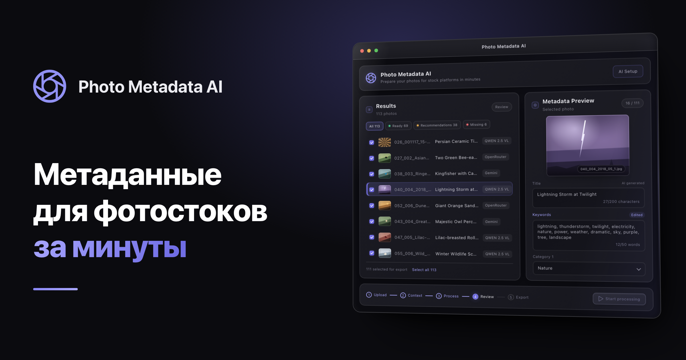
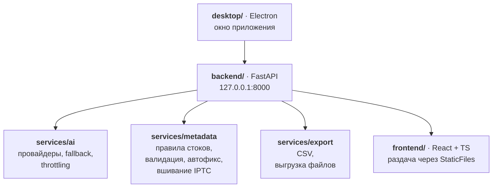

<div align="center">

# Photo Metadata AI

**Десктопное приложение для macOS, которое готовит фотографии к загрузке на фотостоки.**

AI анализирует каждый кадр, генерирует полный набор метаданных, пересобирает их под
выбранную площадку (Adobe Stock, Shutterstock, Getty Images), вшивает IPTC в файлы и выгружает CSV.

[](https://github.com/SlavaKlkv/photo_metadata_ai/releases)
[](#установка)
[](backend/)
[](frontend/)
[](desktop/)
[](#лицензия)

[**Страница проекта**](https://slavaklkv.github.io/photo_metadata_ai/landing/) ·
[Все экраны](https://slavaklkv.github.io/photo_metadata_ai/landing/screens.html) ·
[Скачать `.dmg`](https://github.com/SlavaKlkv/photo_metadata_ai/releases) ·
[Установка](#установка) ·
[Как это устроено](#как-это-устроено) ·
[Разработка](#разработка) ·
[Релизы](#релизы)

</div>

> [!NOTE]
> Здесь — то, что нужно для работы с кодом.  
> Обзор продукта — на [странице проекта](https://slavaklkv.github.io/photo_metadata_ai/landing/);  
> исходники страницы лежат в [docs/landing/](docs/landing/),  
> переключатели эффектов описаны в [docs/landing/README.md](docs/landing/README.md).

**Приватность.** Приложение работает локально: фотографии не покидают компьютер, кроме
кадров, отправляемых выбранному AI-провайдеру. С локальной моделью обработка полностью офлайн.

---

## Установка

1. Скачайте `.dmg` из [Releases](https://github.com/SlavaKlkv/photo_metadata_ai/releases).
2. Откройте образ и перетащите **Photo Metadata AI.app** в `Applications`.
3. При первом запуске приложение проведёт через AI Setup: подключение локальной Ollama
   и/или ввод ключей Gemini и OpenRouter.

| Что | Подробности |
| --- | --- |
| **Архитектуры** | Сборка universal2 — работает и на Apple Silicon, и на Intel |
| **Обновления** | Приложение проверяет опубликованные GitHub Releases и сообщает о новой версии баннером. Загрузка и установка ручные: `.dmg` открывается в системном браузере, приложение заменяется в `Applications` |
| **Данные пользователя** | `~/Library/Application Support/Photo Metadata AI` и `~/Documents/Photo Metadata AI/results` — хранятся вне бандла и переживают обновление |

> [!TIP]
> Локальная модель (опционально) — обработка без облака и без ключей:
>
> ```bash
> brew install ollama
> ollama serve
> ollama pull qwen2.5vl
> ```

---

## Как это устроено



- **Один бандл, один origin, без CORS.** Electron и бэкенд-бинарник едут внутри одного
  `Photo Metadata AI.app`, а собранный фронтенд раздаёт сам бэкенд — в приложении всё живёт
  на `127.0.0.1:8000`. Подробности сборки и релиза — в [desktop/README.md](desktop/README.md).
- **Ключевое архитектурное решение.** AI возвращает platform-agnostic набор полей, а правила
  конкретного стока (лимиты title, число и словари ключевых слов и категорий, типы лицензий,
  editorial-поля, состав колонок CSV) применяются позже, в `services/metadata`. Поэтому смена
  площадки не требует перегенерации, а автофикс правит только формальные нарушения и не
  трогает поля, отредактированные вручную.

Интерфейс — мастер из пяти шагов:

| # | Шаг | Что происходит |
| --- | --- | --- |
| 1 | **Upload** | JPEG-файлы перетаскиваются в окно или выбираются в диалоге |
| 2 | **Context** | Заметки о съёмке, AI-провайдер, сток и формат экспорта |
| 3 | **Process** | Генерация полей без привязки к площадке |
| 4 | **Review** | Поля пересобраны под выбранный сток — остаётся проверить |
| 5 | **Export** | CSV и копии фотографий с метаданными — в папку результатов |

### Контракт метаданных

За один проход по кадру AI возвращает platform-agnostic набор полей — намеренно
с запасом, чтобы под конкретный сток их можно было урезать, а не догенерировать.
Все текстовые поля — только на английском, как требуют площадки.

| Группа | Поля |
| --- | --- |
| **Основное** | `title` (минимум 5 значимых слов), `description` (минимум одно фактическое предложение), `keywords` (минимум 15 уникальных, по убыванию важности) |
| **Классификация** | `categories` (1–2 широких кандидата), `license_type` (commercial/editorial), `is_illustration`, `mature_content`, `ai_generated_content_disclosure` |
| **Локация** | `location` — `sublocation`, `city`, `province_state`, `country` — и читаемая строка `location_metadata`; заполняются только когда место действительно известно |
| **Editorial** | `is_editorial`, `editorial_caption`, `editorial_date` |
| **Люди и права** | `has_people`, `people_count`, `model_release_available`, `releases` |

### Правила площадок

Живут в `services/metadata` и применяются к уже сгенерированным полям: урезают title
под лимит, приводят число ключевых слов к диапазону, переводят категории в словарь
площадки, подставляют допустимый тип лицензии и собирают свой набор колонок CSV.

| Правило | Adobe Stock | Shutterstock | Getty Images |
| --- | --- | --- | --- |
| **Лимит title** | 70 символов | 2048 (предупреждение после 150) | 200 |
| **Ключевых слов** | до 49 | до 50 | до 50 |
| **Категорий** | 1 | до 2 | до 2 |
| **Пример: «wildlife» →** | `Animals` | `Animals/Wildlife` | `Nature` |
| **Типы лицензии** | standard / extended / editorial | commercial / editorial | creative / editorial |
| **Свои колонки CSV** | `AI Disclosure`, `Illustration`, `Mature Content` | `Illustration`, `Mature Content` | `Category 2`, `License Type`, `Editorial Date` |

Дубликаты ключевых слов удаляются, порядок по важности сохраняется.

**Валидация и автофикс**

- Замечания делятся на ошибки и рекомендации.
- Автофикс чинит формальные нарушения: добивает слишком короткий title, обрезает длинный,
  приводит число ключевых слов к границам, убирает дубликаты, подставляет категорию по умолчанию.
- Поля, отредактированные вручную, помечаются подсветкой подписи — автофикс их не перезаписывает.

**Экспорт**

- Поля вшиваются в IPTC самого JPEG (описание, название, ключевые слова, категория,
  локация), поэтому едут вместе с кадром, а не живут отдельной таблицей.
- Съёмочный EXIF при этом сохраняется.
- Выгрузить можно весь пакет, только файлы со статусом Ready или все без ошибок.

### Провайдеры

| Провайдер | Модель | Доступ |
| --- | --- | --- |
| **Ollama** | Qwen2.5-VL | локально, офлайн, без ключа |
| **Google Gemini** | облачная | API-ключ |
| **OpenRouter** | облачная | API-ключ |

Провайдеры образуют кольцо fallback: при таймауте, 429 или ошибке файл автоматически
уходит к следующему — с cooldown и адаптивным ограничением параллельных запросов.
Ключи проверяются на онбординге и хранятся в пользовательском каталоге данных, вне бандла.

### Стек

| Слой | Технологии |
| --- | --- |
| **Backend** | Python 3.11+, FastAPI, Uvicorn, Pydantic, aiohttp, httpx, Pillow, structlog, iptcinfo3, uv, Ruff, pytest |
| **Frontend** | React 18, TypeScript, Zustand, Sass, axios, react-scripts, Jest, Testing Library |
| **Desktop** | Electron 33, electron-builder, PyInstaller (universal2), Jest |

---

## Разработка

**Переменные окружения**

```bash
cp .env.example .env
```

Для локальной Ollama на этой же машине — `OLLAMA_BASE_URL=http://localhost:11434`.

**Backend**

```bash
cd backend
uv sync --dev
uv run uvicorn app.main:app --reload --host 0.0.0.0 --port 8000
```

**Frontend**

```bash
cd frontend
npm install
npm start
```

**Desktop**

```bash
cd desktop
npm install
npm run dev
```

**Адреса**

| Что | Адрес |
| --- | --- |
| Frontend | [http://localhost:3000](http://localhost:3000) |
| Backend | [http://localhost:8000](http://localhost:8000) |
| Swagger UI | [http://localhost:8000/docs](http://localhost:8000/docs) |
| ReDoc | [http://localhost:8000/redoc](http://localhost:8000/redoc) |

### Новые зависимости

```bash
cd backend  && uv add <lib>          # runtime
cd backend  && uv add --dev <lib>    # dev
cd frontend && npm install <lib>
```

---

## Проверки

**Линтинг и форматирование бэкенда**

```bash
cd backend
uv run ruff format
uv run ruff check --fix
```

**Тесты с покрытием**

```bash
cd backend   && uv run pytest --cov=app --cov-report=term-missing
cd frontend  && npm test -- --coverage --runInBand
cd desktop   && npm test -- --coverage
```

**Сборка**

```bash
cd frontend && npm run build     # production-сборка фронтенда
desktop/scripts/build-mac.sh     # полная сборка macOS: .app и .dmg в desktop/out/
```

---

## Релизы

Релиз собирается GitHub Actions по тегу `v*`:

```
срезы бэкенда (arm64, x86_64, нативно) → склейка в universal2 → .dmg → Releases
```

> [!IMPORTANT]
> Приложение подписывается **ad-hoc**: учётных данных Apple Developer нет, поэтому
> нотаризации не будет. При первом запуске macOS покажет предупреждение о неизвестном
> разработчике — открывается через правый клик по приложению → «Открыть».

<details>
<summary>Почему ad-hoc, а не совсем без подписи</summary>

Без подписи вовсе macOS считала скачанный бандл повреждённым и не давала открыть его
из Finder совсем, поэтому ad-hoc здесь не косметика. Полный разбор подписи, обходов
Gatekeeper и порядка публикации версии — в [desktop/README.md](desktop/README.md).

</details>

---

## Лицензия

MIT
