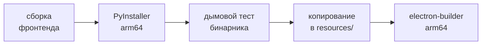

# Photo Metadata AI — macOS Desktop

Electron-оболочка, упаковывающая FastAPI-бэкенд (PyInstaller, arm64)
и React-фронтенд в macOS-приложение для Apple Silicon (`.app`/`.dmg`).

Общее описание проекта и команды разработки — в [корневом README](../README.md).

## Архитектура

- **Один origin, без CORS.** Бэкенд-бинарник сам раздаёт собранный фронтенд
  (FastAPI `StaticFiles` на `/`), Electron просто открывает `http://localhost:8000`.
- **Electron управляет только жизненным циклом:** запуск бэкенда, ожидание health,
  окно, завершение процесса при выходе.
- **Бинарник backend лежит в `resources/backend/arm64/`** — путь с архитектурой
  сохранён: по нему бинарник ищет `src/backend-process.js`.
- **Данные пользователя живут вне бандла** и переживают обновления:
  `~/Library/Application Support/Photo Metadata AI` (задачи, настройки, SQLite)
  и `~/Documents/Photo Metadata AI/results`.

> [!NOTE]
> Приложение собирается только под Apple Silicon. Intel-срез убран вместе с
> поддержкой архитектуры: macOS 26 Tahoe — последняя версия macOS для Intel-маков,
> а x86_64-раннеры GitHub Actions доступны лишь до 2027 года.

## Требования

| Что | Зачем |
| --- | --- |
| Node.js 20 LTS | та же версия используется в release workflow |
| [uv](https://docs.astral.sh/uv/) | окружения и запуск бэкенда |
| Xcode Command Line Tools | `lipo` для проверки архитектуры, `codesign` |

## Запуск в разработке

```bash
cd desktop && npm install && npm run dev
```

Оболочка сама выбирает способ запуска бэкенда — первый подходящий из трёх:

| # | Когда | Что запускается |
| --- | --- | --- |
| 1 | Упакованное приложение | бинарник из `resources/backend/arm64/` |
| 2 | Dev с собранным бинарником | `backend/dist/photo-metadata-backend`, если он существует |
| 3 | Dev из исходников | `uv run python -m app.desktop_main` — самый быстрый цикл, PyInstaller не нужен |

## Полная сборка

После любых доработок фронтенда или бэкенда свежий `.app`/`.dmg` со всеми изменениями
получается одной командой — скрипт сам пересоберёт фронтенд, бэкенд-бинарники и приложение:

```bash
desktop/scripts/build-mac.sh
```

Артефакты появляются в `desktop/out/` (`.dmg`, `.zip`, `mac-arm64/Photo Metadata AI.app`).

Что делает скрипт по шагам:



Готовый бинарник раскладывается в `resources/backend/arm64/`. Исходный `build/icon.png`
1024×1024 конвертируется в ICNS средствами electron-builder.

Частичный запуск (как в release workflow):

| Флаг | Что делает |
| --- | --- |
| `--backend-only=arm64` | только фронтенд + backend (нативно, хост обязан быть Apple Silicon) |
| `--app-only` | только electron-builder; ожидает готовый бинарник в `resources/backend/arm64/` |

## Дымовой тест бэкенд-бинарника

```bash
uv run --project backend python desktop/scripts/smoke-test.py [путь-к-бинарнику]
```

Проверяет health, раздачу встроенного фронтенда и загрузку JPEG. При наличии
`OPENROUTER_API_KEY` или `GEMINI_API_KEY` в окружении дополнительно прогоняет
process → results → export.

## Дистрибуция

Учётных данных Apple Developer нет, поэтому нотаризации нет. Для пользователя это
означает карантин на скачанном файле и предупреждение при первом запуске —
см. порядок ниже.

Что задано в `electron-builder.yml` и почему это лучше не трогать:

| Параметр | Зачем |
| --- | --- |
| `identity: '-'` | ad-hoc подпись бандла. Сама по себе ничего не даёт пользователю, но без неё приложение не запускается на Apple Silicon |
| `signIgnore: Contents/Resources/backend/` | бэкенд не подписывается отдельно: на framework-сборке Python electron-builder падает на вложенном `Python.framework` |
| `hardenedRuntime: false` | вместе с library validation ad-hoc `.dylib` внутри бэкенда не проходят проверку, и приложение падало бы на старте |

> [!IMPORTANT]
> Порядок первого запуска: перетащить приложение в `Applications` **до** первого
> запуска, запустить оттуда, в предупреждении нажать «Готово», затем Системные
> настройки → «Конфиденциальность и безопасность» → **«Открыть всё равно»**.
>
> Порядок важен: разрешение Gatekeeper выдаётся конкретному экземпляру. Проверено —
> у разрешённой копии `spctl` по-прежнему `rejected`, а её копия в другом каталоге
> блокируется отдельно. Поэтому приложение, разрешённое в папке загрузок, после
> переноса в `Applications` снова упирается в предупреждение.
>
> Если UI-путь не срабатывает — снять карантин в терминале:
>
> ```bash
> xattr -dr com.apple.quarantine "/Applications/Photo Metadata AI.app"
> ```
>
> Скачанный файл может открыться не сразу: системе нужно время на проверку. Открывать
> его стоит из Finder, а не из панели загрузок браузера.

### Обновление (ручной flow)

Авто-установки обновлений нет: electron-updater на macOS рассчитан на Developer ID /
нотаризированный дистрибутив, ad-hoc для этого недостаточно. Что есть вместо неё:

| Где | Что происходит |
| --- | --- |
| **Баннер** | При появлении новой опубликованной версии приложение показывает сверху ненавязчивый баннер. **Download** открывает `.dmg` из GitHub Releases в системном браузере, **Dismiss** скрывает уведомление именно для этой версии |
| **Меню** | В нативном меню **Photo Metadata AI** всегда доступен пункт **Check for Updates…**. Ручная проверка запрашивает свежие данные и показывает системный диалог: **You're using the latest version** либо номер доступной версии с кнопкой **Download**. Скрытие баннера ручную проверку не отключает |
| **Установка** | Остаётся ручной: скачать новый `.dmg` и перетащить приложение в `Applications` поверх старого. Данные пользователя (задачи, настройки, результаты) живут вне бандла и полностью переживают замену |

Источник версии desktop-приложения — `desktop/package.json`. Версии frontend и backend
внутренние и не синхронизируются с версией релиза.

### Публикация новой версии

1. Изменить `version` в `desktop/package.json` и закоммитить изменение.
2. Создать совпадающий тег и отправить его: `git tag vX.Y.Z && git push origin vX.Y.Z`.
3. GitHub Actions соберёт arm64 `.dmg` и `.zip` и загрузит их в draft-релиз.
4. Проверить draft-релиз и опубликовать его вручную.

> [!NOTE]
> Draft-релизы не участвуют в проверке обновлений. Баннер появится у пользователей
> только после ручной публикации релиза.

## Логи

Вывод бэкенда: `~/Library/Logs/Photo Metadata AI/backend.log`.

## Известные ограничения v1

- **Ad-hoc подпись, без нотаризации.** При первом открытии нужен обход Gatekeeper
  (см. «Дистрибуция»), автоматическая установка обновлений невозможна.
- **Порт 8000 фиксирован.** Второй экземпляр приложения не запустится, пока занят порт
  (single-instance lock фокусирует уже открытое окно).
